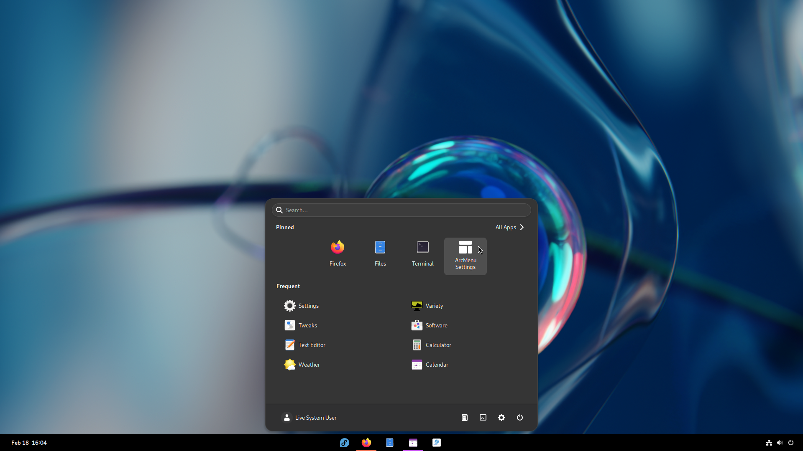

# Dash to "Windows"
This repository contains my configuration files for the Gnome Extensions "[Dash to Panel](https://extensions.gnome.org/extension/1160/dash-to-panel/)" and "[ArcMenu](https://extensions.gnome.org/extension/3628/arcmenu/)" on Fedora.

## Dash to Panel
The panel has been configured to resemble the Windows 10 / 11 task bar, without changing too many of the default settings.

The panel height, and the icon size and spacing should match exactly.

[Download Config](./DashToPanel.cfg?raw=1)

## ArcMenu
The ArcMenu theme has been configured to look like the default Gnome Dash style (e.g. like the Calendar and Quick Settings). 
Themes that resemble the Adwaita theme (dark and light) are also included.

The ArcMenu layout is set to "11" to match the Windows 11 start menu, but can be easily changed.

The Menu button is set to the Fedora icon and colors, but can also be easily changed.

[Download Config](./ArcMenu.cfg?raw=1)

## Result

